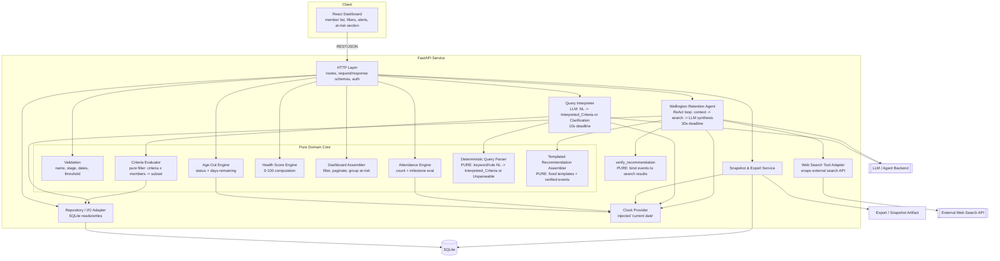
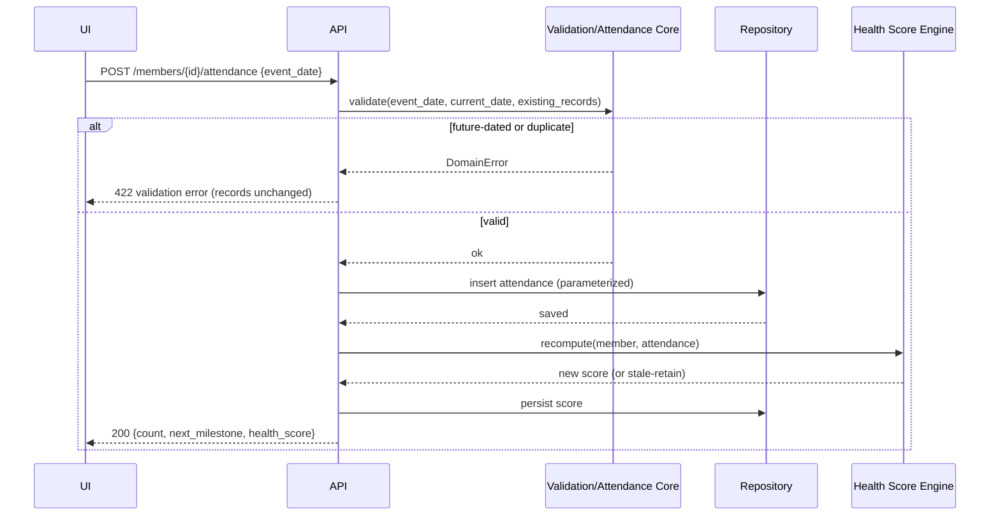
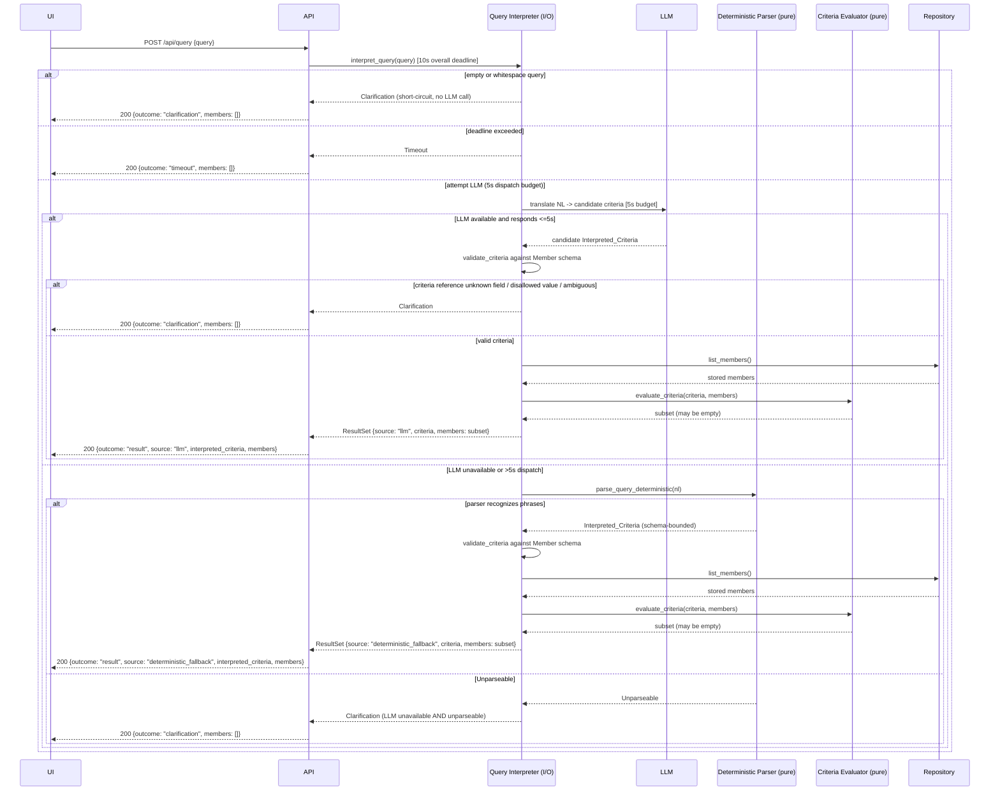
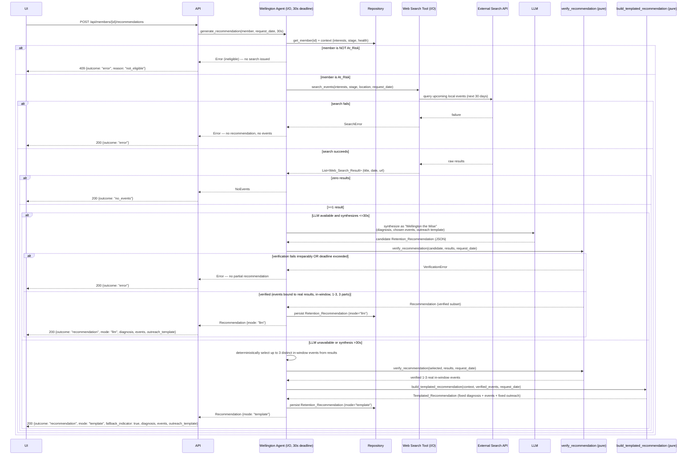
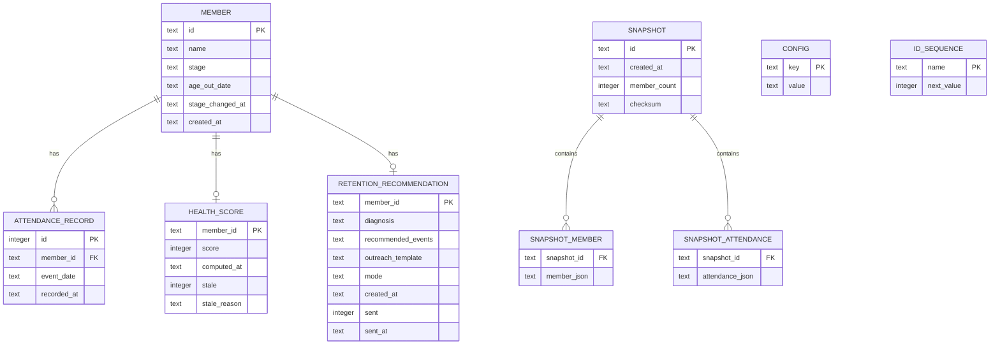

# Design Document: Smart Member Growth Tracker

## Overview

The Smart Member Growth Tracker (the **Member_Tracker**) is a centralized system of record for a JCI chapter's member journey, from Prospective Member through induction and active membership. It replaces scattered spreadsheets with a single dashboard that manages member records, tracks age-out deadlines with automated alerts, records attendance against induction milestones, computes a 0–100 Health_Score to flag at-risk members, preserves all member data across the annual "One Year to Lead" leadership handover through timestamped snapshots and exports, and lets administrators retrieve targeted member sets by asking plain-English questions.

The natural-language querying capability (Requirement 7) is layered onto the same store: an LLM-backed **Query_Interpreter** translates a plain-English `Natural_Language_Query` into structured `Interpreted_Criteria`, and a **pure, deterministic criteria evaluator** applies those criteria to the stored members to produce a `Query_Result_Set`. This split is the central design decision for this requirement — the non-deterministic language understanding is isolated in the LLM, while the guarantees that matter for correctness (results are always a subset of real stored data, never fabricated) live in a pure function that can only ever select from its input member set and is therefore provable by property-based testing. When the `LLM_Backend` is unavailable or exceeds a 5-second dispatch budget, the interpreter falls back to a **pure, deterministic `Deterministic_Query_Parser`** that maps recognized keywords/phrases to the *same* schema-bounded `Interpreted_Criteria`; because the identical pure evaluator then does the selection, the subset/non-fabrication guarantees hold unchanged regardless of interpreter source (Req 7.9–7.12).

The AI-powered member retention capability (Requirement 8) applies the *same pattern* to a new problem: an LLM-driven **Wellington Retention Agent** ("Wellington the Wise") analyzes an `At_Risk_Member`, issues a real-time web search for upcoming local seminars/networking events/skill workshops, and synthesizes a structured `Retention_Recommendation` (a diagnosis, 1–3 `Recommended_Event` entries, and an `Outreach_Template`). The non-determinism (the live web search and the LLM synthesis, both time-bounded to 30 seconds) is isolated in I/O adapters, while the correctness-critical **anti-fabrication guarantee** lives in a **pure, deterministic** `verify_recommendation` function that binds every `Recommended_Event` back to an actually-returned `Web_Search_Result`. The agent can only reference events the search truly returned; fabricated or out-of-window events are structurally impossible in a verified recommendation, making Req 8.5 (structure) and Req 8.6 (non-fabrication) provable by property-based testing — exactly as the criteria evaluator does for Requirement 7. When the search succeeds with ≥1 result but the `LLM_Backend` is unavailable or fails to complete synthesis within 30 seconds, the agent produces a **`Templated_Recommendation`**: its diagnosis and `Outreach_Template` come from **fixed text templates** assembled by a **pure, deterministic** template builder, while its 1–3 events are selected deterministically from the *real* `Web_Search_Result` set and still pass through the same `verify_recommendation`. The template fallback never invents events — it is only reachable when the search returned ≥1 result, so zero results still yield no-events and a failed search still yields an error (Req 8.11–8.14).

This design targets the existing project stack observed in the repository:

- **Backend**: Python + FastAPI, with SQLite for persistence (mirroring `backend/database.py` and `backend/main.py` conventions — `sqlite3` with `row_factory`, parameterized queries, a startup `init_db()` hook, and API-key-guarded admin endpoints).
- **Frontend**: React + Vite (mirroring `agenttrace/dashboard`), a tab/section-based dashboard consuming a JSON REST API.

The design decomposes cleanly into a pure **domain/computation layer** (validation, date math, milestone evaluation, health scoring, filtering, natural-language criteria evaluation) and an **I/O layer** (persistence, snapshots, export, HTTP, LLM interpretation). This separation is deliberate: it keeps the risk-sensitive business logic pure and deterministic so it can be verified with property-based tests, while confining side effects (DB writes, file production, clock reads) to thin adapters. All requirements are traced through the sections below and formalized in the Correctness Properties section.

### Goals

- One authoritative store for member records and attendance.
- Deterministic, testable derived metrics (age-out status, attendance progress, Health_Score).
- Zero data loss across leadership handovers via snapshots and exports.
- A single filterable dashboard that never presents stale data as current.

### Non-Goals

- Multi-chapter tenancy and cross-chapter reporting (single-chapter scope for this feature).
- Authentication/identity provider integration beyond the existing API-key gate (sign-in is assumed handled by the surrounding platform; Requirement 5.4 concerns data *access scope* after handover, not credential management).
- Real-time push updates; the dashboard refreshes on load (Requirement 6.6 is a load-time freshness guarantee, not a live socket).

## Architecture

The system is a three-layer application: a React dashboard, a FastAPI service exposing a JSON REST API, and a SQLite datastore. The FastAPI service is internally split into a **pure domain core** and **I/O adapters**.



### Layering and Rationale

- **Pure domain core** — All functions in the core are pure: they take explicit inputs (including the "current date" injected via a Clock Provider) and return values or errors with no side effects. This makes age-out math, milestone evaluation, health scoring, and filtering fully deterministic and directly amenable to property-based testing. **Design decision**: the current date is *never* read from the wall clock inside domain logic; it is passed in. This is what makes date-dependent properties (age-out windows, future-dated attendance) reproducible under test.
- **Repository / I/O adapter** — Encapsulates all SQLite access using parameterized queries (consistent with `backend/database.py`). It is the only component that mutates persistent state, giving a single choke point for the "leave existing records unchanged on rejection" guarantees.
- **Snapshot & Export service** — Orchestrates all-or-nothing capture of member + attendance data into a snapshot row and an export artifact, with timeout and integrity handling.
- **HTTP layer** — Translates requests into core calls and repository operations, maps domain errors to HTTP status codes, and enforces the API key on administrative endpoints.

### Natural-Language Query Layering and Rationale (Requirement 7)

Natural-language querying is deliberately split into two components with opposite trust characteristics:

- **Query Interpreter (I/O adapter, non-deterministic)** — Calls the LLM/agent backend to translate a `Natural_Language_Query` into a structured `Interpreted_Criteria` value (or a `Clarification` when the query is ambiguous/uninterpretable). It also enforces the 10-second deadline: the interpretation call runs under a bounded timeout, and on breach the interpreter yields a `Timeout` outcome rather than a partial result. The LLM output is *never trusted directly* — before criteria are used they are validated against the known Member schema. Additionally, the LLM call carries a **5-second dispatch budget**: if the `LLM_Backend` is unavailable or does not respond within 5 seconds of dispatch, the interpreter abandons the LLM path and falls back to the `Deterministic_Query_Parser` (below), all within the same overall 10-second bound (Req 7.9).
- **Deterministic Query Parser (pure domain core, deterministic)** — A pure function `parse_query_deterministic(nl) -> Interpreted_Criteria | Unparseable` that uses non-LLM keyword/rule matching to map recognized phrases in a `Natural_Language_Query` to the **same schema-bounded `Interpreted_Criteria`** the LLM path emits (e.g., "prospective" → `stage = Prospective`, "at risk" → `at_risk = true`, "aged out" → `age_out_status = AgedOut`). It performs no I/O and calls no backend. If it recognizes no interpretable phrase it returns `Unparseable`. Because it emits the *identical* schema-bounded criteria consumed by `validate_criteria` and the *identical* pure `evaluate_criteria` performs the selection, the subset/non-fabrication guarantee (Req 7.2/7.10) is preserved automatically — the fallback changes only *how criteria are derived*, never *how members are selected*.
- **Criteria Evaluator (pure domain core, deterministic)** — A pure function `evaluate_criteria(criteria, members) -> subset` that applies validated `Interpreted_Criteria` to an explicitly supplied list of stored members and returns the matching subset. This is where the non-fabrication and subset guarantees live: the evaluator receives the member set as an argument and can only ever return elements drawn from it, so by construction it cannot invent records or fields. Because it is pure and deterministic, the subset/soundness/completeness guarantees are directly provable by property-based testing. It is used **unchanged** on both the LLM and deterministic-parser paths.

**Design decision — why the split.** Correctness for Requirement 7 hinges on the guarantee that results are always a subset of real stored data and never contain fabricated records or fields (Req 7.2). If the LLM produced the result set directly, that guarantee would be unverifiable. By constraining the LLM to only emit *criteria* and having a pure function do the selection over real stored rows, the fabrication risk is structurally eliminated and becomes a property we can test with randomized inputs. The LLM's only job is NL→criteria translation, which is covered by example/integration tests.

**Design decision — deterministic fallback preserves the guarantee for free.** The `Deterministic_Query_Parser` sits in the *same slot* as the LLM: it produces schema-bounded `Interpreted_Criteria` and nothing else. Both criteria sources flow through the same `validate_criteria` and the same pure `evaluate_criteria` over the same stored member list. Consequently the subset/non-fabrication property (Property 22) holds identically no matter which interpreter derived the criteria — the guarantee is a property of the evaluator, not of the interpreter. When the parser succeeds, the `ResultSet` is tagged with `source = "deterministic_fallback"` so the UI can indicate the fallback was used (Req 7.10); when the parser returns `Unparseable` and the LLM was unavailable, the interpreter yields a `Clarification` with zero members (Req 7.11).

**Design decision — schema-bounded criteria.** `Interpreted_Criteria` may only reference known `Member` fields (`name`, `stage`, `age_out_date`, derived `age_out_status`, `attendance_count`, `health_score`, `at_risk`) with allowed operators and, for enumerated fields, allowed values (e.g., `stage ∈ {Prospective, Candidate, Inducted, Inactive}`). Criteria that reference an unknown field or a disallowed value for an enumerated field are rejected by the validation step; the interpreter then returns a `Clarification` outcome (Req 7.5). This keeps the evaluator total over valid criteria and prevents the LLM from steering queries toward non-existent fields.

**Design decision — exactly one outcome.** For any query the interpreter yields exactly one of four outcomes: a `ResultSet` (which may be non-empty, Req 7.1/7.3, or empty, Req 7.4), a `Clarification` (Req 7.5/7.6), or a `Timeout` error (Req 7.8). The empty-result case is still a `ResultSet` outcome (with zero members), distinct from `Clarification`. Empty/whitespace queries short-circuit to `Clarification` before any LLM call (Req 7.6). Mutual exclusivity (Req 7.7) is guaranteed by returning a single sum-typed value. The single-outcome and 10-second bound hold identically on the deterministic-parser fallback path: a fallback `ResultSet` (tagged `source = "deterministic_fallback"`) or an `Unparseable`-driven `Clarification` is still exactly one of the same outcomes within the same bound (Req 7.12).

### Retention Agent Layering and Rationale (Requirement 8)

The AI-powered retention capability reuses the Requirement 7 pattern — isolate the non-deterministic parts (live web search + LLM synthesis) in I/O adapters, and keep the correctness-critical guarantee in a pure, deterministic function — applied to a new agentic workflow.

- **Web Search Tool Adapter (I/O, non-deterministic)** — Wraps the external search API (e.g., Google Search API) behind a single narrow interface `search_events(interests, stage, location, request_date) -> List[Web_Search_Result]`. It is the only component that reaches the network for events; it translates the agent's query into an API call and normalizes each hit into a `Web_Search_Result` carrying at minimum a title, an event date, and a source URL. It performs no synthesis and makes no correctness claims — it just returns what the search returned. This is the single choke point for the "live event data" side effect, mirroring how the Repository is the single choke point for persistence.
- **Wellington Retention Agent (I/O orchestrator, non-deterministic, bounded by a 30s deadline)** — A ReAct-style orchestrator that: (1) loads the member's context from the repository, (2) guards eligibility (rejects non-`At_Risk_Member` requests *before* any search), (3) calls the Web Search Tool for events in the `[request_date, request_date + 30d]` window matching the member's interests or `Membership_Stage`, (4) prompts the LLM — under the "Wellington the Wise" persona — to synthesize a candidate `Retention_Recommendation` (diagnosis, chosen events, outreach template), and (5) passes the LLM's candidate through the **pure** `verify_recommendation` before returning it. The whole loop runs under a 30-second deadline; on breach or any failure it yields an `Error` outcome with no partial recommendation.
- **`verify_recommendation` (PURE domain core, deterministic)** — The anti-fabrication and structure guarantee. A pure function `verify_recommendation(recommendation, search_results, request_date) -> Result<Recommendation, VerificationError>` that (a) confirms every `Recommended_Event`'s title/date/url match an actually-returned `Web_Search_Result`, (b) confirms each event date lies within `[request_date, request_date + 30d]`, (c) enforces the 1–3 event count, that each event maps to a *distinct* returned result, and the exactly-three-parts structure (diagnosis + events + outreach template), rejecting (or repairing down to the verified subset) anything that fails. It receives the search-result set as an explicit argument and can only bless events drawn from it. It runs on **both** the LLM synthesis path and the template fallback path.
- **`build_templated_recommendation` (PURE domain core, deterministic)** — The fallback assembler. A pure function `build_templated_recommendation(member_context, verified_events, request_date) -> Retention_Recommendation` that fills **fixed diagnosis and outreach text templates** (parameterized only by safe, stored member context such as name and stage) and attaches the already-verified 1–3 `Recommended_Event` entries. It authors no event facts and reaches no backend; the events it embeds have already passed `verify_recommendation`, so the resulting `Templated_Recommendation` carries the same exactly-three-parts, 1–3-real-in-window-events structure as an LLM-synthesized one. It is invoked only after a successful search returned ≥1 result and events were verified.

**Design decision — purity of `verify_recommendation` guarantees non-fabrication.** Correctness for Requirement 8 hinges on the guarantee that every `Recommended_Event` is real — drawn from an event the search actually returned — and never invented by the LLM (Req 8.6), and that a recommendation has exactly three parts with 1–3 in-window events (Req 8.5). If the LLM's raw output were returned directly, that guarantee would be unverifiable: a language model can and will hallucinate plausible-looking events, dates, and URLs. By funneling every candidate through a pure function that binds each event back to the concrete `Web_Search_Result` set it was given, fabrication becomes *structurally impossible* in a verified recommendation — the function literally cannot bless an event it was not handed. Because it is pure and deterministic, this becomes a property we can prove with randomized inputs, exactly like `evaluate_criteria` for Requirement 7. The LLM's remaining, unverified job — diagnosis prose and outreach wording — carries no fabrication risk to member-facing event facts and is covered by example/integration tests.

**Design decision — eligibility guard precedes any search.** The agent checks `At_Risk` status first and rejects a non-at-risk member with an ineligible error *without issuing a web search and without producing a recommendation* (Req 8.2). This is both a cost control (no wasted external calls) and a testable invariant: for a non-at-risk member, the search tool is never invoked.

**Design decision — exactly one outcome under a 30s deadline.** For any intervention request on an at-risk member, the agent returns exactly one of three mutually exclusive outcomes within 30 seconds: a `Recommendation` (search returned ≥1 event and synthesis+verification succeeded, Req 8.4/8.5), a `NoEvents` indication (search returned zero results, Req 8.7), or an `Error` (eligibility failure, search/LLM failure, or deadline breach, Req 8.8). `NoEvents` and `Error` carry zero `Recommended_Event` entries and no `Retention_Recommendation`; a zero-result search always yields `NoEvents` (never a partial recommendation). Mutual exclusivity is guaranteed by returning a single sum-typed `RetentionOutcome` value.

**Design decision — LLM-unavailable template fallback (Req 8.11–8.14).** The LLM synthesis step and the template fallback are *mutually exclusive branches* taken **after** a successful search that returned ≥1 result. If the `LLM_Backend` is unavailable or does not complete synthesis within the 30-second deadline, the agent does **not** fail: it selects up to 3 distinct in-window events **directly and deterministically** from the returned `Web_Search_Result` set, runs them through the same pure `verify_recommendation`, and assembles a `Templated_Recommendation` via the pure `build_templated_recommendation` assembler. The resulting `Recommendation` outcome is tagged `mode = "template"` (versus `mode = "llm"` on the synthesis path) so the UI can surface a fallback-mode (template-generated) indicator (Req 8.11). Because the fallback branch is only reachable *after* a search that returned ≥1 result, the non-fabrication guarantee is preserved (events are still real, verified, in-window) and the never-invent-events rule is structural: **zero results still yield `NoEvents`, and a failed search still yields `Error`, even when the LLM is unavailable** — the assembler is never invoked in those branches (Req 8.13). The eligibility guard of criterion 2 still runs first (Req 8.12). The single-outcome-within-30s guarantee holds unchanged on the fallback path: still exactly one of `Recommendation` (template mode), `NoEvents`, or `Error` (Req 8.14).

### Request Flow Example (Record Attendance)



### Request Flow Example (Natural-Language Query)



### Request Flow Example (Retention Intervention — Wellington the Wise)



## Components and Interfaces

Interfaces are expressed as language-neutral signatures. Backend implementation is Python; the pure core functions map to module-level functions and small dataclasses.

### 1. Validation Component

Responsible for all input validation, returning either a normalized value or a structured `ValidationError` with a machine-readable `code` and human-readable `message`.

```
validate_name(name: str) -> Result<str, ValidationError>
    # non-empty after trim, length 1..100; code = "name_missing_or_invalid" (Req 1.3)

validate_stage(value: str) -> Result<MembershipStage, ValidationError>
    # value ∈ {Prospective, Candidate, Inducted, Inactive}; code = "invalid_stage" (Req 1.4, 1.5)

validate_age_out_date(date: DateInput, current_date: Date) -> Result<Date, ValidationError>
    # well-formed calendar date AND date >= current_date; code = "invalid_or_past_age_out_date" (Req 2.1, 2.2)

validate_threshold(value: any) -> Result<int, ValidationError>
    # integer in [0,100]; code = "threshold_out_of_range" (Req 4.6, 4.7)

validate_event_date(date: DateInput, current_date: Date) -> Result<Date, ValidationError>
    # well-formed AND date <= current_date; code = "future_dated_attendance" (Req 3.1, 3.5)
```

### 2. Age-Out Engine (pure)

```
AgeOutStatus = NotApplicable | AlertActive{days_remaining: int} | AgedOut | Normal

age_out_status(age_out_date: Optional[Date], current_date: Date) -> AgeOutStatus
    # None -> NotApplicable (Req 2.5)
    # current_date > age_out_date -> AgedOut, no pre-out alert (Req 2.4)
    # 0 <= (age_out_date - current_date) <= 30 -> AlertActive{days_remaining = whole days} (Req 2.3)
    # otherwise -> Normal
```

**Design decision**: `days_remaining` is a whole-number count of calendar days (`age_out_date - current_date`), inclusive of both the 30th-day boundary and the age-out date itself, matching Req 2.3. The window is defined as `0 <= delta <= 30`. `AgedOut` and `AlertActive` are mutually exclusive by construction (Req 2.4).

### 3. Attendance Engine (pure)

```
attended_count(records: List[AttendanceRecord]) -> int   # non-negative (Req 3.3)

milestone_progress(count: int, milestones: List[int]) -> MilestoneProgress
    # returns { achieved: List[int], next_unmet: Optional[int], all_achieved: bool } (Req 3.3, 3.4)
    # a milestone m is achieved iff count >= m (Req 3.4)
    # next_unmet = smallest milestone > satisfied set, or None -> all_achieved = true

is_duplicate(records, member_id, event_date) -> bool   # supports Req 3.2
```

### 4. Health Score Engine (pure)

```
HealthResult = Computed{score: int} | StaleRetained{previous: int, reason: str}

compute_health_score(member: MemberView, attendance: List[AttendanceRecord],
                     current_date: Date, config: ScoringConfig) -> HealthResult
    # returns integer in [0,100], higher = lower risk (Req 4.1)
    # if required inputs missing/incomplete -> StaleRetained(previous, reason) (Req 4.3)

classify_at_risk(score: int, threshold: int) -> bool
    # true iff score <= threshold (Req 4.4)
```

See "Health Score Computation Approach" below for the scoring model.

### 5. Dashboard Assembler (pure)

```
DashboardRow = { member_id, name, stage, age_out_status, attendance_progress, health_score, at_risk: bool, score_stale: bool }

build_dashboard(members, attendance_by_member, config, current_date,
                filter_stage: Optional[MembershipStage],
                page: int, page_size: int = 50) -> DashboardView
    # rows for every member (Req 6.1)
    # if filter_stage set -> only rows whose stage == filter_stage (Req 6.4)
    # at-risk rows grouped into one contiguous section (Req 4.5)
    # paginate into pages of at most 50 (Req 6.2)
    # empty-state flags: no_members (Req 6.3), no_match (Req 6.5)
```

### 6. Repository / I/O Adapter

```
create_member(name, stage, age_out_date?) -> MemberId          # Req 1.1
update_member_stage(id, stage) -> void                          # Req 1.2 (records UTC change timestamp)
set_age_out_date(id, date) -> void                              # Req 2.1
add_attendance(member_id, event_date) -> void                   # Req 3.1
get_member(id) / list_members() / list_attendance(member_id)
save_health_score(id, score, computed_at, stale?, reason?)      # Req 4.2, 4.3
get_config() / set_at_risk_threshold(value)                     # Req 4.6
```

**Design decision**: `create_member` obtains its unique identifier from a monotonic ID allocator persisted in the datastore (a dedicated sequence counter table), *not* from `MAX(id)+1` over live rows. This guarantees identifiers are unique across existing **and previously deleted** records (Req 1.1), because deletions never roll the counter back.

### 7. Snapshot & Export Service

```
create_snapshot(current_time: DateTime) -> SnapshotId | Error   # Req 5.1, 5.2, 5.3
list_snapshots() -> List[SnapshotMeta]
load_snapshot(id) -> SnapshotContents | Error                   # Req 5.5, 5.6 (integrity check)
accessible_member_count_after_handover() -> int                 # Req 5.4
export_all() -> ExportFile | Error                              # Req 5.7, 5.8
```

**Design decision**: snapshot creation and export are **all-or-nothing**. The snapshot is assembled and its integrity checksum computed before it is committed as retained; on failure or timeout (60s) the partial snapshot is discarded and pre-existing data is untouched (Req 5.2). Export writes to a temporary artifact and only exposes it once fully written; a failed/timed-out export produces no file (Req 5.8).

### 8. Query Interpreter and Criteria Evaluator (Requirement 7)

The interpreter is an I/O adapter (it calls the LLM and reads the clock for the deadline); the evaluator is a pure function in the domain core.

```
# --- Structured criteria (schema-bounded) ---
MemberField    = "name" | "stage" | "age_out_status" | "attendance_count" | "health_score" | "at_risk"
Comparison     = "eq" | "neq" | "lt" | "lte" | "gt" | "gte" | "contains" | "in"
Condition      = { field: MemberField, comparison: Comparison, value: any }
Interpreted_Criteria = { conditions: List[Condition], combinator: "and" | "or" }
    # human-readable when rendered; every condition names a known field, a valid
    # comparison for that field's type, and an allowed value (Req 7.3)

# --- Outcomes (exactly one is returned per query, Req 7.7 / 7.12) ---
QuerySource  = "llm" | "deterministic_fallback"
QueryOutcome =
      ResultSet{ source: QuerySource, criteria: Interpreted_Criteria, members: List[Member] }  # Req 7.1, 7.3, 7.4, 7.10 (members may be empty)
    | Clarification{ message: str }                                        # Req 7.5, 7.6, 7.11
    | Timeout{ message: str }                                              # Req 7.8

# --- Interpreter (I/O, non-deterministic, bounded by a 10s overall deadline) ---
interpret_query(nl: str, members: List[Member], current_date: Date,
                deadline_seconds: int = 10, llm_dispatch_budget_seconds: int = 5) -> QueryOutcome
    # 1. if nl is empty or whitespace-only -> Clarification (no LLM call)     (Req 7.6)
    # 2. else dispatch nl to the LLM_Backend under a 5s dispatch budget       (Req 7.9)
    #    - if LLM responds <=5s with candidate criteria -> validate & evaluate
    #    - on ambiguous/uninterpretable -> Clarification                      (Req 7.5)
    #    - if LLM_Backend unavailable OR no response within 5s ->
    #      fall back to parse_query_deterministic(nl)                         (Req 7.9)
    #        * criteria -> validate_criteria -> evaluate_criteria,
    #          return ResultSet{source="deterministic_fallback", ...}         (Req 7.10)
    #        * Unparseable -> Clarification (LLM unavailable AND unparseable)  (Req 7.11)
    # 3. validate candidate criteria against the Member schema (both paths)
    #    - unknown field or disallowed value -> Clarification                 (Req 7.5)
    # 4. subset = evaluate_criteria(criteria, members)  (pure, both paths)
    #    return ResultSet{source, criteria, subset}                           (Req 7.1, 7.4, 7.10)
    # entire flow bounded by 10s; exactly one outcome on either path          (Req 7.7, 7.12)

validate_criteria(criteria: Interpreted_Criteria) -> Result<Interpreted_Criteria, CriteriaError>
    # accepts iff every condition references a known MemberField, uses a
    # comparison valid for that field's type, and (for enumerated fields such
    # as stage / age_out_status / at_risk) uses an allowed value              (Req 7.2, 7.5)

# --- Deterministic Query Parser (PURE, deterministic) — LLM-unavailable fallback ---
parse_query_deterministic(nl: str) -> Interpreted_Criteria | Unparseable
    # non-LLM keyword/rule matcher. Maps recognized phrases to the SAME
    # schema-bounded Interpreted_Criteria the LLM path emits, e.g.:
    #   "prospective"/"candidate"/"inducted"/"inactive" -> stage = <value>
    #   "at risk"/"at-risk"                              -> at_risk = true
    #   "aged out"                                       -> age_out_status = AgedOut
    #   "attended N"/"N+ events"                         -> attendance_count >= N
    # Returns Unparseable if no recognized phrase is found.                   (Req 7.9, 7.10, 7.11)
    # Pure: no I/O, no backend call. Emits the identical criteria schema, so
    # validate_criteria + evaluate_criteria enforce subset/non-fabrication.

# --- Criteria Evaluator (PURE, deterministic) — used unchanged on both paths ---
evaluate_criteria(criteria: Interpreted_Criteria, members: List[Member]) -> List[Member]
    # returns the sublist of `members` that satisfy `criteria`.
    # By construction the result is a subset of `members`: it selects, never
    # constructs, records, and it only reads fields present on each Member.
    # No field or record can appear that is absent from the input.            (Req 7.1, 7.2, 7.4, 7.10)
```

**Design decision — evaluator purity guarantees non-fabrication.** `evaluate_criteria` takes the member list as an explicit argument and returns a filtered sublist of it; it performs no I/O and constructs no new member records. This makes Req 7.2 (subset of stored data, no fabricated records/fields) a structural property rather than a runtime hope: the function literally has no way to produce a member it was not given. The interpreter always passes the *current stored* members (read from the repository at query time), so the subset guarantee extends end to end. This holds identically whether the criteria came from the LLM or from `parse_query_deterministic` — both feed the *same* evaluator over the *same* stored members, so the deterministic fallback inherits the non-fabrication guarantee automatically (Req 7.10).

**Design decision — empty result vs clarification.** A syntactically valid query that simply matches nothing yields `ResultSet{criteria, members: []}` (Req 7.4), which is distinct from `Clarification` (Req 7.5/7.6). This distinction is what lets the UI show "no members match your query" (with the interpreted criteria) separately from "we couldn't understand your query."

**Design decision — 10s deadline placement.** Only the LLM interpretation call is time-bounded by the deadline; validation, the deterministic parser, and the pure evaluator are effectively instantaneous. The interpreter starts a monotonic timer on receiving the query. The LLM dispatch carries a **5-second budget**: if the `LLM_Backend` is unavailable or does not respond within 5 seconds, the interpreter abandons it and takes the deterministic-parser fallback path, all comfortably inside the overall 10-second bound (Req 7.9, 7.12). If the whole flow nonetheless fails to yield an outcome within 10 seconds, the interpreter returns `Timeout` with zero members (Req 7.8). The overall API response is therefore bounded by ~10s plus negligible evaluation time (Req 7.7).

### 9. Wellington Retention Agent, Web Search Tool, and Recommendation Verifier (Requirement 8)

The Web Search Tool and the agent are I/O adapters (network + LLM + clock); `verify_recommendation` is a pure function in the domain core. This mirrors the component 8 split (interpreter = I/O, evaluator = pure).

```
# --- Value objects ---
Web_Search_Result = { title: str, event_date: Date, url: str, snippet?: str }
Recommended_Event = { title: str, event_date: Date, url: str, reason: str }
Retention_Recommendation = {
    diagnosis: str,                       # why the Health_Score is low
    events: List[Recommended_Event],      # 1..3, each bound to a real Web_Search_Result
    outreach_template: str,               # ready-to-send draft, authored as Wellington the Wise
    mode: "llm" | "template"              # provenance: LLM-synthesized or template-assembled (Req 8.11)
}
MemberContext = { member_id, name, stage, interests: List[str], location?, health_score, at_risk: bool }

# --- Outcomes (exactly one is returned per request, Req 8.4 / 8.14) ---
RetentionOutcome =
      Recommendation{ rec: Retention_Recommendation }   # Req 8.5, 8.6 (llm mode) OR Req 8.11 (template mode); search returned >=1 event, verified
    | NoEvents{ message: str }                          # Req 8.7, 8.13 (search returned zero results)
    | Error{ message: str, reason: str }                # Req 8.2 (ineligible), 8.8/8.13 (failure/timeout)

# --- Web Search Tool (I/O, non-deterministic) ---
search_events(interests: List[str], stage: MembershipStage, location: Optional[str],
              request_date: Date) -> List[Web_Search_Result]
    # queries the external search API for upcoming local seminars, networking
    # events, and skill workshops matching interests or stage, restricted to
    # events with event_date in [request_date, request_date + 30 days]         (Req 8.3)
    # returns each hit normalized with title, event_date, url; may be empty

# --- Wellington Retention Agent (I/O orchestrator, ReAct loop, 30s deadline) ---
generate_recommendation(member: MemberContext, request_date: Date,
                        deadline_seconds: int = 30) -> RetentionOutcome
    # 1. eligibility guard: if not member.at_risk -> Error(reason="not_eligible")
    #    WITHOUT calling search_events and WITHOUT producing a recommendation  (Req 8.2, 8.12)
    # 2. results = search_events(member.interests, member.stage,
    #                            member.location, request_date)                (Req 8.3)
    #    - if search fails -> Error, no recommendation, no events              (Req 8.8, 8.13)
    # 3. if results is empty -> NoEvents (zero events, no recommendation)       (Req 8.7, 8.13)
    #    (holds even when the LLM_Backend is unavailable — template fallback
    #     is NEVER reached on a zero-result search)                            (Req 8.13)
    # 4a. LLM path: if LLM_Backend available, prompt it as "Wellington the Wise"
    #     to synthesize a candidate Retention_Recommendation                   (Req 8.5)
    #     verified = verify_recommendation(candidate, results, request_date)   (pure)
    #     - on VerificationError (irreparable) -> Error, no partial rec        (Req 8.8)
    #     - on success -> Recommendation{rec.mode = "llm"}                     (Req 8.5, 8.6)
    # 4b. TEMPLATE FALLBACK: if LLM_Backend unavailable OR synthesis does not
    #     complete within the deadline AFTER a successful search with >=1 result:
    #     - deterministically select up to 3 DISTINCT in-window Web_Search_Result
    #       entries from `results`                                             (Req 8.11)
    #     - verified = verify_recommendation(selected_as_events, results, request_date)  (pure)
    #     - rec = build_templated_recommendation(member, verified.events, request_date)  (pure)
    #     - return Recommendation{rec.mode = "template"}                       (Req 8.11, 8.14)
    # entire loop bounded by 30s; exactly one outcome on either path           (Req 8.4, 8.14)

# --- Recommendation Verifier (PURE, deterministic) — used on BOTH paths ---
verify_recommendation(candidate: Retention_Recommendation,
                      search_results: List[Web_Search_Result],
                      request_date: Date) -> Result<Retention_Recommendation, VerificationError>
    # Binds the candidate to reality. Accepts (possibly after pruning to
    # the verified subset) iff the result:
    #   (a) every Recommended_Event's (title, event_date, url) matches some
    #       Web_Search_Result in search_results — none fabricated              (Req 8.6, 8.11)
    #   (b) each event's date is in [request_date, request_date + 30 days]     (Req 8.6, 8.11)
    #   (c) each event maps to a DISTINCT returned Web_Search_Result           (Req 8.6, 8.11)
    #   (d) event count is between 1 and 3 inclusive                           (Req 8.5, 8.6, 8.11)
    #   (e) the recommendation has exactly three parts: a non-empty diagnosis,
    #       the events list, and a non-empty outreach_template                 (Req 8.5, 8.11)
    # If no valid events remain after pruning, returns VerificationError so the
    # agent yields Error/NoEvents rather than an empty recommendation.

# --- Templated Recommendation Assembler (PURE, deterministic) — fallback only ---
build_templated_recommendation(member: MemberContext,
                               verified_events: List[Recommended_Event],
                               request_date: Date) -> Retention_Recommendation
    # Assembles a Templated_Recommendation from FIXED TEXT TEMPLATES:
    #   - diagnosis: fixed template parameterized only by safe member context
    #     (name, stage) — authored text, no event facts invented
    #   - events: the already-verified 1..3 Recommended_Event entries (verbatim)
    #   - outreach_template: fixed template parameterized by name/stage
    # Sets mode = "template". Pure: no I/O, no backend, invents no events.      (Req 8.11)
    # Precondition (enforced by caller): invoked only after a successful search
    # returned >=1 result and `verified_events` passed verify_recommendation.
```

**Design decision — the verifier is the trust boundary.** `verify_recommendation` receives the concrete `search_results` as an explicit argument and only blesses events whose `(title, event_date, url)` triple matches one of them. It constructs no events of its own, so a verified `Retention_Recommendation` can never contain an event the search did not return (Req 8.6). This makes non-fabrication a *structural* property — provable by feeding random candidates (including fabricated events, out-of-window dates, wrong counts, and missing parts) and asserting the verifier accepts exactly the valid, real, in-window subset. The **same** verifier runs on the template fallback path (Req 8.11): the deterministically-selected events are checked against the real `search_results` before `build_templated_recommendation` assembles them, so a `Templated_Recommendation` carries the identical non-fabrication and 1–3-in-window-events guarantee as an LLM-synthesized one.

**Design decision — 30s deadline placement.** The two non-deterministic steps — the live web search and the LLM synthesis — run inside a bounded 30-second window governed by a monotonic timer. Verification and template assembly are pure and instantaneous. On any failure of the search or on deadline breach, the agent abandons the attempt and returns `Error` with no partial recommendation and no events (Req 8.8), keeping the overall API response bounded by ~30s (Req 8.4). When the **search succeeded with ≥1 result** but the LLM is unavailable or its synthesis does not complete in time, the agent does not return `Error`; instead it takes the deterministic template fallback (select → verify → assemble), which is pure and instantaneous, and returns a `Recommendation` tagged `mode = "template"` still within the 30-second bound (Req 8.11, 8.14). The never-invent-events rule is preserved because the fallback is unreachable unless the search already returned real results.

#### Wellington the Wise — System Prompt Specification

The LLM synthesis step (step 4 of `generate_recommendation`) is driven by a fixed system prompt that establishes the persona and constrains output to a structured, machine-parseable form. The prompt does **not** grant the model authority over which events are real — that is enforced downstream by `verify_recommendation` — but it strongly instructs the model to only use provided events, which reduces verification failures.

- **Persona**: "You are Wellington the Wise, a seasoned, warm, and encouraging JCI chapter mentor. You help re-engage members who are at risk of drifting away."
- **Inputs provided in the prompt**: the member's name, `Membership_Stage`, recorded interests, current `Health_Score`, and the **exact list of `Web_Search_Result` entries** returned by the search tool (title, date, URL). The model is told these are the *only* events it may recommend.
- **Instructions**: (1) Write a brief, empathetic **diagnosis** of why this member's health score is low, grounded in their stage/attendance context. (2) Select **1 to 3** of the provided events that best fit the member's interests or stage, and for each give a one-sentence **reason for fit**. Do not invent events, dates, or URLs; only choose from the provided list. (3) Draft a short, personalized **outreach_template** the administrator can copy and send.
- **Required output format**: a single JSON object with exactly three keys — `diagnosis` (string), `recommended_events` (array of `{title, date, url, reason}`), and `outreach_template` (string). No prose outside the JSON.
- **Downstream enforcement**: whatever the model returns is parsed and passed to `verify_recommendation`, which discards any event not matching a real `Web_Search_Result`, out-of-window dates, and malformed structure. The persona prompt is a best-effort guide; the pure verifier is the guarantee. If the `LLM_Backend` is unavailable or its synthesis times out after a successful search, this prompt is never used — the agent instead assembles a `Templated_Recommendation` from fixed templates (see the template fallback in `generate_recommendation`), producing warm but non-personalized diagnosis/outreach text while keeping the same verified real events.

### HTTP API Surface

| Method & Path | Purpose | Requirements |
| --- | --- | --- |
| `POST /api/members` | Create member | 1.1, 1.3, 1.4 |
| `PATCH /api/members/{id}/stage` | Change stage | 1.2, 1.4 |
| `PUT /api/members/{id}/age-out-date` | Set age-out date | 2.1, 2.2 |
| `POST /api/members/{id}/attendance` | Record attendance | 3.1, 3.2, 3.5 |
| `GET /api/dashboard?stage=&page=` | Dashboard view (includes intervention-eligible flag on at-risk rows) | 6.1–6.7, 4.5, 8.1 |
| `PUT /api/config/at-risk-threshold` | Configure threshold | 4.6, 4.7 |
| `POST /api/handover/snapshots` | Create snapshot | 5.1–5.3 |
| `GET /api/handover/snapshots` | List snapshots | 5.3 |
| `GET /api/handover/snapshots/{id}` | View snapshot contents | 5.5, 5.6 |
| `GET /api/export` | Export all data | 5.7, 5.8 |
| `POST /api/query` | Natural-language member query (response carries `source: "llm" \| "deterministic_fallback"`) | 7.1–7.12 |
| `POST /api/members/{id}/recommendations` | Generate a retention recommendation (Wellington the Wise; response carries `mode: "llm" \| "template"`) | 8.2–8.8, 8.11–8.14 |
| `GET /api/members/{id}/recommendations` | View stored recommendation + copy-outreach action | 8.9 |
| `POST /api/members/{id}/recommendations/sent` | Mark recommendation as sent (records UTC timestamp) | 8.10 |

## Data Models

SQLite schema (parameterized access via the repository, consistent with `backend/database.py`).



### Field Notes

- **MEMBER.id** — system-generated, drawn from `ID_SEQUENCE`; unique across live and deleted rows (Req 1.1).
- **MEMBER.stage** — constrained to `{Prospective, Candidate, Inducted, Inactive}` at both the domain layer and a DB `CHECK` constraint (Req 1.5).
- **MEMBER.age_out_date** — ISO `YYYY-MM-DD` or NULL (NULL ⇒ "not applicable", Req 2.5).
- **MEMBER.stage_changed_at** — UTC timestamp recorded on each stage change (Req 1.2).
- **ATTENDANCE_RECORD** — unique constraint on `(member_id, event_date)` enforces no duplicates (Req 3.2).
- **HEALTH_SCORE** — one row per member; `stale`/`stale_reason` support Req 4.3.
- **RETENTION_RECOMMENDATION** — one row per member holding the most recent verified `Retention_Recommendation`. `recommended_events` stores the 1–3 verified `Recommended_Event` entries as a JSON array (`title`, `event_date`, `url`, `reason`), each bound to a real `Web_Search_Result` (Req 8.5, 8.6, 8.11). `mode` records the provenance — `"llm"` for LLM-synthesized or `"template"` for a `Templated_Recommendation` produced by the fixed-template fallback — and drives the UI's fallback-mode indicator (Req 8.11). `created_at` is a UTC timestamp; `sent` is a 0/1 flag and `sent_at` is the UTC timestamp recorded when the administrator marks the recommendation as sent (`sent_at` NULL until then) (Req 8.7 storage, 8.10).
- **CONFIG** — key/value store; holds `at_risk_threshold` (default configurable) and the milestone thresholds list.
- **SNAPSHOT.checksum** — integrity hash over the snapshot's member+attendance payload; verified on load (Req 5.6). `created_at` is ISO 8601 with UTC offset (Req 5.3); retained ≥ 84 months.

### Enumerations and Value Objects

```
MembershipStage = "Prospective" | "Candidate" | "Inducted" | "Inactive"
ScoringConfig   = { attendance_weight, recency_weight, stage_weight, at_risk_threshold, milestones: List[int] }
```

## Health Score Computation Approach

The Health_Score is a deterministic pure function producing an integer in `[0, 100]` where higher means lower dropout risk (Req 4.1). It is a weighted, bounded aggregate of signals that are all derivable from stored member and attendance data, so the same inputs always yield the same score (a prerequisite for property-based testing).

**Signals (each normalized to `[0, 1]`):**

1. **Attendance depth** — attended-event count relative to the highest milestone target (capped at 1.0). More attendance ⇒ higher score.
2. **Attendance recency** — how recently the member last attended relative to a configured recency window (e.g., days since last event, decaying to 0). More recent ⇒ higher score.
3. **Stage progression** — an ordinal signal from `Membership_Stage`: `Inactive` lowest, then `Prospective`, `Candidate`, `Inducted` highest.

**Aggregation:**

```
raw = attendance_weight * attendance_depth
    + recency_weight    * attendance_recency
    + stage_weight      * stage_progression
score = clamp(round(raw * 100), 0, 100)
```

Weights come from `ScoringConfig` and are non-negative and sum to 1, guaranteeing `raw ∈ [0,1]` and therefore `score ∈ [0,100]` before rounding; the explicit `clamp` is a defensive invariant that keeps the output in range even under configuration edge cases (Req 4.1).

**Recomputation trigger**: whenever a member's attendance or stage changes and is persisted, the engine recomputes within the 5-second budget (Req 4.2). Because the function is pure and in-memory, computation is sub-millisecond; the budget is a service-level guarantee, not an algorithmic constraint.

**Missing/incomplete data**: if a required input is absent or malformed such that a score cannot be computed, the engine returns `StaleRetained(previous, reason)` — the previous score is kept, a stale indicator is surfaced, and the reason is recorded (Req 4.3).

**At-risk classification**: a member is At_Risk iff `score <= threshold`, using the configured threshold (Req 4.4, 4.6). At-risk rows are grouped contiguously on the dashboard (Req 4.5).

## Error Handling

Errors are modeled as structured values in the domain core and mapped to HTTP responses at the boundary. The overriding principle: **rejections never mutate persisted state** — validation runs before any write, and writes are atomic.

| Condition | Domain behavior | HTTP | Requirement |
| --- | --- | --- | --- |
| Missing/blank/oversized name | Reject; records unchanged | 422 | 1.3 |
| Invalid Membership_Stage | Reject; records unchanged | 422 | 1.4 |
| Invalid or past-dated Age_Out_Date | Reject; retain prior age-out value | 422 | 2.2 |
| Duplicate attendance (same member+date) | Reject; retain existing record | 409 | 3.2 |
| Future-dated attendance | Reject; do not store | 422 | 3.5 |
| Threshold non-integer or out of [0,100] | Reject; retain prior threshold | 422 | 4.7 |
| Health score inputs incomplete | Retain previous, mark stale, record reason | 200 (with stale flag) | 4.3 |
| Snapshot creation fails/times out (60s) | Discard partial; data unchanged | 500 | 5.2 |
| Snapshot missing/integrity-check fails | Error; other snapshots retained | 404/409 | 5.6 |
| Export fails/times out (60s) | No partial file; error | 500 | 5.8 |
| Dashboard data retrieval fails | Error; retain last good view, no partial/stale as current | 503 | 6.7 |
| NL query empty or whitespace-only | Short-circuit to clarification; no LLM call; zero members | 200 (clarification outcome) | 7.6 |
| NL query ambiguous/uninterpretable, or criteria reference unknown field/disallowed value | Return clarification; zero members | 200 (clarification outcome) | 7.5 |
| LLM_Backend unavailable or no response within 5s of dispatch (query) | Fall back to `parse_query_deterministic`; on parse success return fallback-tagged result set; still within 10s | 200 (result outcome, `source: "deterministic_fallback"`) | 7.9, 7.10 |
| LLM_Backend unavailable AND deterministic parser returns Unparseable | Return clarification; zero members | 200 (clarification outcome) | 7.11 |
| LLM interpretation exceeds 10s deadline | Cancel call; return timeout error; zero members | 200 (timeout outcome) | 7.8 |
| Retention intervention requested for non-at-risk member | Reject with ineligible error; no web search issued; no recommendation | 409 (error outcome) | 8.2, 8.12 |
| Retention web search returns zero results | Return no-events indication; zero events; no recommendation | 200 (no-events outcome) | 8.7 |
| Retention web search or LLM synthesis fails, or exceeds 30s deadline | Return error indication; no partial recommendation; no events | 200 (error outcome) | 8.4, 8.8 |
| LLM candidate contains fabricated/out-of-window events or malformed structure | `verify_recommendation` prunes to the verified real, in-window subset; if none remain, return error/no-events (never a partial/fabricated recommendation) | 200 (recommendation or error outcome) | 8.5, 8.6 |
| LLM_Backend unavailable/times out but search returned ≥1 result | Deterministically select ≤3 distinct in-window events → verify → assemble `Templated_Recommendation` from fixed templates; tag `mode: "template"`; UI shows fallback-mode indicator | 200 (recommendation outcome, `mode: "template"`) | 8.11, 8.14 |
| LLM_Backend unavailable AND search returned zero results | Return no-events indication; no recommendation; template assembler never invoked | 200 (no-events outcome) | 8.13 |
| LLM_Backend unavailable AND web search fails | Return error indication; no recommendation; no events; template assembler never invoked | 200 (error outcome) | 8.13 |

**Timeouts** for snapshot and export use a bounded operation with a deadline; on breach the operation is abandoned and any partial artifact discarded. **Integrity checks** compare the stored checksum against a recomputed checksum on load. **Concurrency/atomicity**: writes use SQLite transactions so a failed write leaves no partial mutation, upholding every "leave existing records unchanged" clause.

## Correctness Properties

_A property is a characteristic or behavior that should hold true across all valid executions of a system — essentially, a formal statement about what the system should do. Properties serve as the bridge between human-readable specifications and machine-verifiable correctness guarantees._

The pure domain core (validation, age-out math, attendance/milestone logic, health scoring, filtering, snapshot/export serialization, natural-language criteria evaluation, and retention-recommendation verification) is well suited to property-based testing: its functions are deterministic, take explicit inputs (including an injected current date), and have universal behaviors that must hold across a large input space. Timing/SLA guarantees (2s persist, 5s recompute, 60s snapshot/export, 3s load freshness, 10s query response, 30s retention response) and infrastructure-only checks — including the non-deterministic LLM NL→criteria translation, the LLM retention synthesis, and the live web search — are covered by integration and example tests instead (see Testing Strategy).

The properties below were derived from the prework analysis and consolidated to remove redundancy (e.g., age-out alert/aged-out/not-applicable folded into one status property; attendance accept/reject folded into one validation-partition property; snapshot create+load folded into one round-trip).

### Property 1: Issued member identifiers are globally unique

_For any_ sequence of member create and delete operations, every identifier the Member_Tracker issues is distinct from every other identifier it has ever issued, including identifiers of previously deleted members.

**Validates: Requirements 1.1**

### Property 2: Stage update preserves identity and applies the new stage

_For any_ member and any valid Membership_Stage different from its current stage, after the update the member's stored stage equals the new value and the member's unique identifier is unchanged.

**Validates: Requirements 1.2**

### Property 3: Blank names are always rejected without side effects

_For any_ name that is empty or composed solely of whitespace, submission is rejected with a name-invalid error and the set of existing member records is unchanged.

**Validates: Requirements 1.3**

### Property 4: Stored stage is always one of the four allowed values

_For any_ sequence of operations (including attempts to set invalid stages), every stored member's Membership_Stage is one of Prospective, Candidate, Inducted, or Inactive, and any create/update carrying a value outside that set is rejected with the existing records left unchanged.

**Validates: Requirements 1.4, 1.5**

### Property 5: Age-out date is accepted exactly when well-formed and not past

_For any_ candidate age-out value and current date, the value is stored if and only if it is a well-formed calendar date on or after the current date; otherwise it is rejected and the member's previously stored age-out value is retained.

**Validates: Requirements 2.1, 2.2**

### Property 6: Age-out status is correct and mutually exclusive

_For any_ member and current date: if the member has no age-out date the status is "not applicable" with no alert and no aged-out flag; if the age-out date is before the current date the status is "aged out" with no active pre-out alert; if the whole-day difference from the current date to the age-out date is between 0 and 30 inclusive the status is an active alert whose days-remaining equals that whole-day difference; and these outcomes are mutually exclusive.

**Validates: Requirements 2.3, 2.4, 2.5**

### Property 7: Attendance is stored exactly when non-future and non-duplicate

_For any_ member, event date, and current date, an attendance record is stored if and only if the event date is on or before the current date and no record already exists for that member and date; otherwise it is rejected (future-dated or duplicate error) and the member's existing attendance set is unchanged.

**Validates: Requirements 3.1, 3.2, 3.5**

### Property 8: Attendance count and milestone progress are correct

_For any_ set of attendance records and any list of milestone thresholds, the reported attended count is a non-negative integer equal to the number of records, a milestone is reported as achieved if and only if the count is greater than or equal to that milestone, and the reported next-unmet milestone is the smallest unmet milestone — or "all achieved" when no unmet milestone remains.

**Validates: Requirements 3.3, 3.4**

### Property 9: Health score is always an integer within range

_For any_ member data, attendance set, and scoring configuration, the computed Health_Score is an integer between 0 and 100 inclusive.

**Validates: Requirements 4.1**

### Property 10: Incomplete data preserves the previous score as stale

_For any_ member whose attendance or stage data is missing or incomplete such that a score cannot be computed, recomputation returns the member's previous Health_Score unchanged, marks the score as stale, and records a non-empty reason.

**Validates: Requirements 4.3**

### Property 11: At-risk classification matches the configured threshold

_For any_ Health_Score and any configured threshold in [0, 100], the member is classified as At_Risk if and only if the score is less than or equal to the threshold.

**Validates: Requirements 4.4, 4.6**

### Property 12: Invalid thresholds are rejected and the prior threshold is retained

_For any_ submitted threshold that is non-integer or outside the range 0 to 100 inclusive, the configuration is rejected and the previously configured threshold is retained.

**Validates: Requirements 4.7**

### Property 13: At-risk records are grouped contiguously

_For any_ set of member records, in the assembled dashboard all At_Risk_Member rows form a single contiguous section — no non-at-risk row appears between two at-risk rows.

**Validates: Requirements 4.5**

### Property 14: Snapshot round-trip preserves all data

_For any_ datastore state, creating a Handover_Snapshot and then loading it yields exactly the set of member records and attendance records present at creation time, with no additions, omissions, or alterations.

**Validates: Requirements 5.1, 5.5**

### Property 15: Failed snapshot creation leaves data unchanged

_For any_ datastore state, if snapshot creation fails at any point, no retained snapshot is created and the pre-existing member and attendance data is unchanged.

**Validates: Requirements 5.2**

### Property 16: Accessible member count equals the most-recent snapshot count

_For any_ pre-handover datastore state, after a leadership handover the count of accessible member records equals the member count captured in the most recent Handover_Snapshot.

**Validates: Requirements 5.4**

### Property 17: Snapshot corruption is isolated

_For any_ collection of retained snapshots, if one snapshot is missing or fails its integrity check, loading it returns an unavailable error while every other snapshot remains loadable and unchanged.

**Validates: Requirements 5.6**

### Property 18: Export round-trip preserves all data

_For any_ datastore state, exporting member data and then parsing the produced file yields exactly the set of member records and attendance records present at export time.

**Validates: Requirements 5.7**

### Property 19: Every member appears once with all required fields

_For any_ set of member records, the assembled dashboard contains exactly one row per member, and each row includes the member's name, Membership_Stage, age-out status, attendance progress, and Health_Score.

**Validates: Requirements 6.1**

### Property 20: Pagination partitions the member list without loss

_For any_ set of member records with a page size of 50, every page contains at most 50 rows and the pages concatenated in order reproduce the full member list exactly once, with no duplicated or omitted records.

**Validates: Requirements 6.2**

### Property 21: Stage filter returns exactly the matching members

_For any_ set of member records and any selected Membership_Stage, the filtered dashboard contains every member whose stage equals the selection and no member whose stage differs.

**Validates: Requirements 6.4**

### Property 22: Query results never fabricate data — always a subset of stored members

_For any_ list of stored Member records and any valid Interpreted_Criteria, the Query_Result_Set produced by the pure criteria evaluator is a subset of the input member list: every returned Member is one of the input Members (identity-equal, carrying only field values present on that stored record), and no Member record or field value appears in the result that is absent from the input.

**Validates: Requirements 7.1, 7.2**

### Property 23: Evaluator is sound and complete with respect to the criteria

_For any_ list of stored Member records and any valid Interpreted_Criteria, a Member appears in the Query_Result_Set if and only if that Member satisfies the Interpreted_Criteria; consequently every returned Member satisfies the criteria, every non-returned input Member does not, and when no Member satisfies the criteria the Query_Result_Set is empty.

**Validates: Requirements 7.1, 7.4**

### Property 24: Interpreted criteria reference only known fields and allowed values

_For any_ candidate Interpreted_Criteria, criteria validation accepts it if and only if every condition references a known Member field, uses a comparison valid for that field's type, and (for enumerated fields such as Membership_Stage) uses an allowed value; any criteria referencing an unknown field or a disallowed value are rejected, yielding a clarification outcome rather than a query result.

**Validates: Requirements 7.2, 7.5**

### Property 25: Every query yields exactly one outcome with a consistent member payload

_For any_ Natural_Language_Query, the Query_Interpreter returns exactly one outcome — a result set, an empty-result indication, a clarification indication, or a timeout error — and never more than one; a clarification, timeout, or empty-result outcome carries zero Member records, an empty match is returned as a result-set outcome (distinct from a clarification), and an empty or whitespace-only query yields a clarification outcome with zero Member records.

**Validates: Requirements 7.3, 7.4, 7.5, 7.6, 7.7, 7.8**

### Property 26: A non-at-risk member is rejected as ineligible with no search performed

_For any_ member that is not currently classified as an At_Risk_Member, a retention-intervention request returns an ineligible error outcome, produces no Retention_Recommendation and no Recommended_Event entries, and the web search tool is never invoked for that request.

**Validates: Requirements 8.2**

### Property 27: Every recommended event is real, distinct, in-window, and never fabricated

_For any_ candidate recommendation, any set of returned Web_Search_Result entries, and any request date, every Recommended_Event in the recommendation that `verify_recommendation` accepts matches the title, event date, and source URL of some returned Web_Search_Result, each accepted event corresponds to a distinct returned Web_Search_Result, and each accepted event's date is on or after the request date and no more than 30 days after it; no accepted event is absent from the returned results (no event is fabricated), and any candidate event that is fabricated, maps to no distinct returned result, or falls outside the 30-day window is rejected.

**Validates: Requirements 8.6**

### Property 28: A verified recommendation has exactly three parts with 1–3 in-window events

_For any_ recommendation that `verify_recommendation` accepts, the recommendation consists of exactly three parts — a non-empty diagnosis, a list of Recommended_Event entries, and a non-empty Outreach_Template — the number of Recommended_Event entries is between 1 and 3 inclusive, and every event's date lies within the 30-day window measured from the request date; any candidate lacking a part, carrying zero or more than three events, or containing an out-of-window event is not accepted as a verified recommendation.

**Validates: Requirements 8.5, 8.6**

### Property 29: Every intervention yields exactly one outcome with a consistent event payload

_For any_ retention-intervention request on an At_Risk_Member, the agent returns exactly one outcome — a Retention_Recommendation, a no-events indication, or an error indication — and never more than one; a no-events or error outcome carries zero Recommended_Event entries and no Retention_Recommendation, and when the web search returns zero Web_Search_Result entries the outcome is the no-events indication.

**Validates: Requirements 8.4, 8.7, 8.8**

### Property 30: Deterministic parser fallback preserves the subset / non-fabrication guarantee

_For any_ list of stored Member records and any Natural_Language_Query that the `Deterministic_Query_Parser` successfully parses into Interpreted_Criteria, the Query_Result_Set produced by applying the pure criteria evaluator to those parsed criteria is a subset of the input member list: every returned Member is one of the input Members (carrying only field values present on that stored record), and no Member record or field value appears in the result that is absent from the input — the identical guarantee as Property 22, holding regardless of whether the criteria were derived by the LLM_Backend or by the deterministic parser.

**Validates: Requirements 7.10**

### Property 31: Query interpreter provenance and single outcome under an unavailable LLM

_For any_ Natural_Language_Query, when the LLM_Backend is unavailable or does not respond within the 5-second dispatch budget, the Query_Interpreter derives criteria using the `Deterministic_Query_Parser` and returns exactly one outcome — and never more than one: if the parser produces criteria it returns a result-set outcome tagged as produced by the deterministic-parser fallback (which may be empty), and if the parser returns Unparseable it returns a clarification indication carrying zero Member records.

**Validates: Requirements 7.9, 7.11, 7.12**

### Property 32: A template-mode recommendation is structurally valid with 1–3 distinct real in-window events

_For any_ non-empty set of returned Web_Search_Result entries and any request date, a `Templated_Recommendation` assembled by the fallback path — after passing `verify_recommendation` — consists of exactly three parts (a non-empty template-assembled diagnosis, a list of Recommended_Event entries, and a non-empty template-assembled Outreach_Template), contains between 1 and 3 Recommended_Event entries each corresponding to a distinct returned Web_Search_Result with a date on or after the request date and no more than 30 days after it, and contains no fabricated event — the same structural and non-fabrication guarantees as Properties 27 and 28 hold for the templated path.

**Validates: Requirements 8.11**

### Property 33: Retention outcome selection under an unavailable LLM yields exactly one non-fabricating outcome

_For any_ retention-intervention request on an At_Risk_Member when the LLM_Backend is unavailable or its synthesis does not complete within the deadline, the agent returns exactly one outcome — and never more than one: when the web search returns one or more Web_Search_Result entries the outcome is a template-mode Recommendation, when the web search returns zero entries the outcome is a no-events indication, and when the web search fails the outcome is an error indication; the no-events and error outcomes carry no Retention_Recommendation and zero Recommended_Event entries, and no outcome in any branch contains a fabricated event.

**Validates: Requirements 8.12, 8.13, 8.14**

## Testing Strategy

### Dual Testing Approach

The system is verified with two complementary layers:

- **Property-based tests** exercise the pure domain core across large randomized input spaces to verify the universal properties above.
- **Unit and integration tests** cover concrete examples, edge cases, error/failure paths, infrastructure wiring, and timing (SLA) guarantees that do not vary meaningfully with input.

### Property-Based Testing

PBT is appropriate here because the domain core is pure and deterministic with clear universal invariants (validation partitions, date math, milestone logic, bounded scoring, structural dashboard invariants, snapshot/export round-trips, the natural-language **criteria evaluator's** subset/soundness/completeness guarantees, the **`Deterministic_Query_Parser`** fallback preserving that same subset guarantee, and the retention **`verify_recommendation`** and **`build_templated_recommendation`** anti-fabrication/structure guarantees on both the LLM and template paths). Note the split for both agentic requirements: for Requirement 7 the pure `evaluate_criteria`/`validate_criteria`/`parse_query_deterministic` are property-tested while the LLM NL→criteria translation is not; for Requirement 8 the pure `verify_recommendation` and `build_templated_recommendation` (and the agent's eligibility guard and outcome selection over mocked/unavailable search & synthesis) are property-tested, while the live web search and LLM synthesis are covered by example/integration tests below.

- **Library**: Python [Hypothesis](https://hypothesis.readthedocs.io/) (the standard property-based testing library for the backend's Python/FastAPI stack). Property-based testing is not implemented from scratch.
- **Iterations**: each property test runs a minimum of 100 generated examples (Hypothesis `max_examples >= 100`).
- **Determinism**: the current date is supplied via the injected Clock Provider so date-dependent properties are reproducible; the datastore uses an in-memory / temporary SQLite database per test.
- **Generators**: custom strategies for names (including whitespace-only and boundary lengths 0/1/100/101), stages (valid set plus arbitrary invalid strings), dates and current-date pairs (spanning past, boundary offsets 0 and 30, and future), attendance sets (including duplicates), milestone lists, scoring configs, thresholds (in-range, out-of-range, non-integer), member lists (including empty), Interpreted_Criteria (valid conditions over known fields, plus criteria referencing unknown fields and disallowed enum values), Natural_Language_Query strings that the deterministic parser recognizes and strings it cannot parse (for the fallback provenance/subset properties), member contexts (at-risk and non-at-risk), Web_Search_Result sets (empty and non-empty, dates spanning in-window boundaries 0/30 and out-of-window), and candidate Retention_Recommendation values (including fabricated events, duplicate event-to-result mappings, out-of-window dates, and 0/1/3/4 event counts).
- **Traceability**: each property test is tagged with a comment referencing its design property, in the format:
  `Feature: jci-hackathon-v2, Property {number}: {property_text}`
- Each of Properties 1–33 is implemented by a single property-based test.

Boundary edge cases identified in prework (age-out deltas of exactly 0 and 30, count exactly at a milestone, score exactly equal to threshold, member count exactly 50 vs 51) are covered within these property generators rather than as separate tests.

### Unit and Example Tests

Used for specific scenarios and edge cases that do not benefit from randomization:

- Snapshot `created_at` parses as ISO 8601 with a UTC offset (Req 5.3 format).
- Empty dataset yields the "no members" empty-state (Req 6.3).
- A stage filter matching zero members yields the "no match" empty-state (Req 6.5).
- Export failure/timeout produces no partial file and returns an error (Req 5.8, edge case).
- Dashboard retrieval failure shows an error and retains the last good view without presenting partial/stale data as current (Req 6.7, edge case).
- An empty or whitespace-only Natural_Language_Query returns a clarification outcome with zero members and makes no LLM call (Req 7.6, with the LLM backend mocked to assert it was not invoked).
- Representative Natural_Language_Query strings translate to the expected Interpreted_Criteria (e.g., "prospective members at risk" → `stage = Prospective AND at_risk = true`), and the successful ResultSet surfaces every condition's field, comparison, and value to the administrator (Req 7.3, LLM translation is non-deterministic so verified by example rather than property).
- An ambiguous/uninterpretable query causes the interpreter to return a clarification outcome with zero members (Req 7.5, LLM ambiguity path via a mocked/representative backend).
- The `Deterministic_Query_Parser`'s keyword/phrase coverage is example-tested: representative phrases map to the expected schema-bounded criteria (e.g., "prospective members at risk" → `stage = Prospective AND at_risk = true`, "aged out" → `age_out_status = AgedOut`, "attended 3+ events" → `attendance_count >= 3`), and phrases with no recognized token yield `Unparseable` (Req 7.9, 7.10 parser recognition, which keywords are supported is example-based not universal).
- With the LLM backend mocked as unavailable, a fallback result set surfaces the fallback-mode indicator to the administrator identifying results as produced by the `Deterministic_Query_Parser` (Req 7.10, UI presentation).
- An at-risk dashboard row surfaces the intervention-eligible indicator, and a member record with a stored Retention_Recommendation renders the recommendation together with copy-outreach and mark-as-sent actions (Req 8.1, 8.9, UI presentation).
- Marking a Retention_Recommendation as sent sets the sent flag and records a well-formed UTC `sent_at` timestamp that is then surfaced on the member record (Req 8.10).
- With a mocked search backend returning zero results for an at-risk member, the agent returns a no-events indication with no recommendation (Req 8.7 example path), and a representative non-empty search yields a verified recommendation whose diagnosis/outreach prose reads as authored by "Wellington the Wise" (Req 8.5, LLM synthesis is non-deterministic so verified by example with a mocked LLM).
- With the LLM backend mocked as unavailable and a mocked non-empty search, a member record with a stored template-mode recommendation renders the fallback-mode (template-generated) indicator alongside the recommendation (Req 8.11, UI presentation of the template fallback).

### Integration Tests

Used for infrastructure wiring, external behavior, and timing/SLA guarantees, with 1–3 representative examples each:

- Member creation persists within 2 seconds (Req 1.1) and attendance saves within 2 seconds (Req 3.1).
- Health_Score is recomputed within 5 seconds of a persisted attendance/stage change (Req 4.2).
- Snapshot creation completes within 60 seconds (Req 5.1) and its timeout/discard path behaves correctly (Req 5.2 timeout branch).
- Export completes within 60 seconds (Req 5.7) and the timeout branch produces no file (Req 5.8 timeout branch).
- Dashboard reflects updated underlying values within 3 seconds of a load request (Req 6.6).
- After-handover access grants the full pre-handover member set end to end (Req 5.4 wired through the API).
- A Natural_Language_Query returns an outcome within 10 seconds end to end (Req 7.7 SLA), and when the LLM backend is induced to exceed the deadline the interpreter returns a timeout outcome with zero members (Req 7.8 timeout branch, using a mock LLM that stalls past the deadline).
- The 5-second LLM dispatch budget and end-to-end deterministic fallback are integration-tested with a mocked/unavailable LLM backend: when the LLM is unavailable or stalls past 5 seconds, the interpreter falls back to the `Deterministic_Query_Parser` and still returns a single outcome within the overall 10-second bound — a fallback-tagged result set when the parser succeeds, or a clarification when it returns `Unparseable` (Req 7.9, 7.11, 7.12 wired through the API).
- With a mocked search backend, a retention intervention for an At_Risk_Member issues a web search whose query reflects the member's interests/stage and restricts to the next-30-day window (Req 8.3, search wiring).
- A retention intervention for an At_Risk_Member returns an outcome within 30 seconds end to end (Req 8.4 SLA); when the mocked search or LLM backend stalls past the deadline or is induced to fail, the agent returns an error outcome with no partial recommendation and no events (Req 8.8 timeout/failure branch).
- End-to-end template fallback is integration-tested with a mocked/unavailable LLM backend: with the LLM unavailable (or synthesis stalled past the deadline) and a mocked search returning ≥1 result, the agent returns a template-mode Recommendation within 30 seconds carrying only real in-window events; with the LLM unavailable and a mocked search returning zero results it returns a no-events indication; and with the LLM unavailable and the mocked search induced to fail it returns an error — the template assembler asserted never called in the latter two branches (Req 8.11, 8.13, 8.14 wired through the API).
- The eligibility guard is wired end to end through `POST /api/members/{id}/recommendations`: a non-at-risk member yields an ineligible error and the mocked search backend is asserted not to have been called (Req 8.2 wired through the API).

### Retention / Policy Verification

The 84-month (7-cycle) snapshot retention requirement (Req 5.3) is verified by a configuration/policy check on the retention setting rather than by elapsed-time testing.

